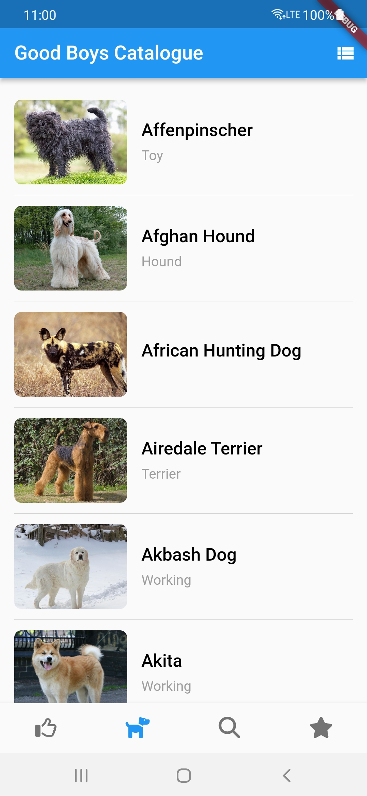
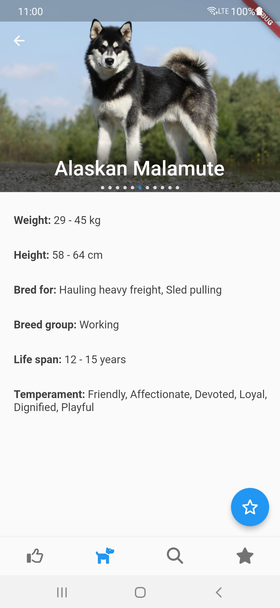
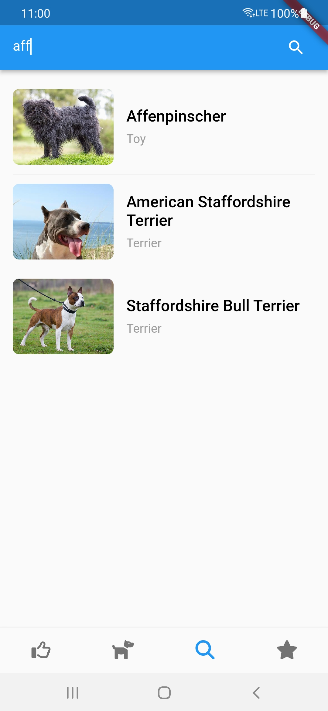
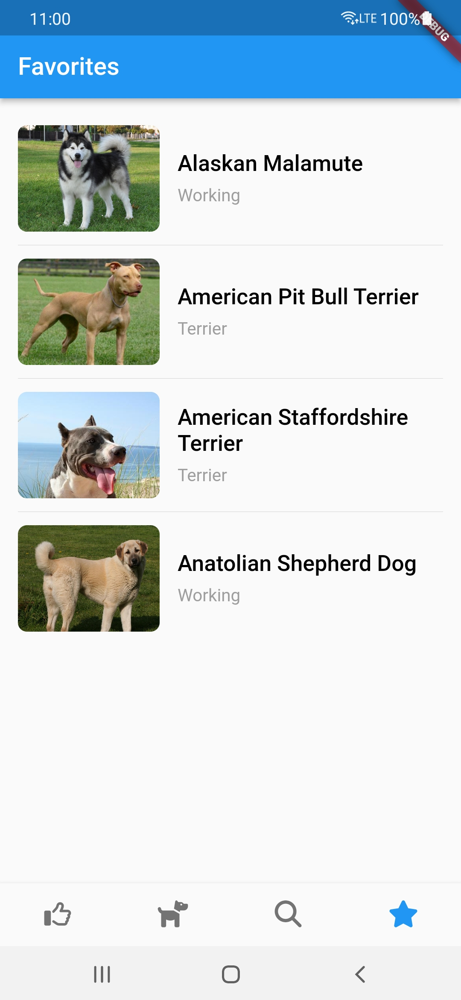
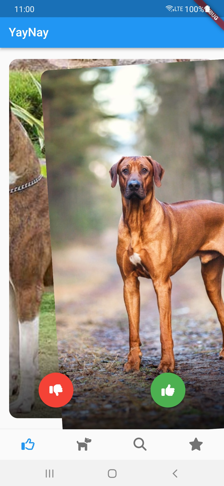

# Good Boys Catalogue

Flutter demo application that utilizes best practices for building Flutter mobile apps.

Displays dog breeds info from [Dog API](https://thedogapi.com/)

## Tech stack
* Architecture design pattern: [BLoC](https://bloclibrary.dev/)
* Navigation: [go_router](https://pub.dev/packages/go_router)
* Localization: [flutter_localizations](https://docs.flutter.dev/accessibility-and-localization/internationalization#setting-up)
* [dio](https://pub.dev/packages/dio) as HTTP client
* [isar](https://pub.dev/packages/isar) as NoSQL local database
* [get_it](https://pub.dev/packages/get_it) as Service Locator
* [freezed](https://pub.dev/packages/freezed) for Code Generation
* [mocktail](https://pub.dev/packages/mocktail) and [bloc_test](https://pub.dev/packages/bloc_test) for unit testing

## Screenshots

| Breeds | Breed details | Search |
|:---:|:---:|:---:|
|  |  |  |
| Favorites | Voting | Video |
|  |   | <video src="https://github.com/4lfant/flutter_demo_app/assets/13089900/34edcca1-49ef-427c-983b-379c70f2f49f" width=250 /> |
